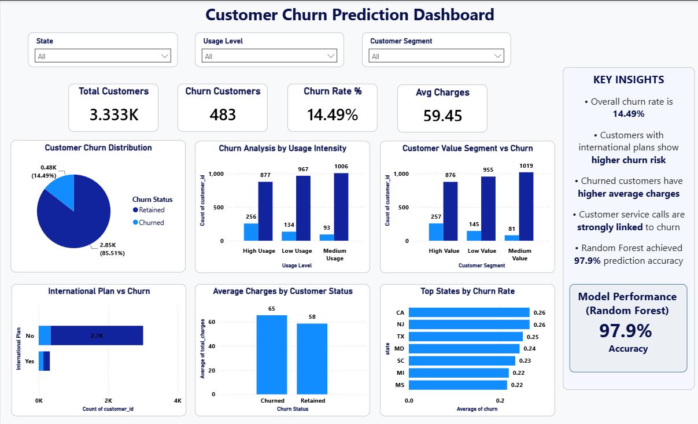

#  Customer Churn Prediction

##  Project Overview

This project focuses on predicting customer churn for a telecommunications company using **Python, Machine Learning, and Power BI**. The objective is to identify customers who are likely to leave the company, understand the key factors influencing churn, and provide actionable business insights to improve customer retention.

---

##  Business Objective

The primary goals of this project are to:

- Predict customers who are likely to churn.
- Identify the major factors contributing to customer churn.
- Help businesses improve customer retention strategies.
- Reduce revenue loss by targeting high-risk customers.
- Support data-driven business decisions through interactive dashboards.

---

##  Tools & Technologies

- Python
- Pandas
- NumPy
- Matplotlib
- Scikit-Learn
- Jupyter Notebook
- Power BI

---

##  Project Structure

```text
Customer-Churn-Prediction
│
├── Dataset
│   ├── full_customers.csv
│   ├── business_costs.csv
│   ├── customer_feedback.csv
│   ├── campaign_uplift.csv
│   └── customer_churn_cleaned.csv
│
├── Notebook
│   └── Customer_Churn_Prediction.ipynb
│
├── Dashboard
│   ├── Customer_Churn.pbix
│   ├── Dashboard.pdf
│   └── Dashboard.png
│
├── README.md
├── requirements.txt
└── LICENSE
```

---

##  Dashboard Preview



---

##  Key Business Insights

-  Overall customer churn rate is **14.49%**.
-  Customers with an **International Plan** have a significantly higher churn risk.
-  Customers making more customer service calls are more likely to churn.
-  Churned customers have higher average account charges.
-  Customer usage intensity strongly influences churn behavior.
-  Early identification of high-risk customers can improve retention and reduce revenue loss.

---

##  Project Workflow

###  Data Cleaning

- Loaded multiple datasets using Pandas
- Checked data types
- Checked missing values
- Removed duplicate records
- Removed unnecessary columns
- Encoded categorical variables
- Prepared data for machine learning

###  Exploratory Data Analysis (EDA)

Performed analysis on:

- Customer churn distribution
- International plan impact
- Customer service calls
- Usage intensity
- Average customer charges
- Customer segmentation

###  Machine Learning

Built and compared multiple classification models:

- Logistic Regression
- Decision Tree Classifier
- Random Forest Classifier

###  Model Evaluation

| Model | Accuracy |
|-------|---------:|
| Logistic Regression | 89.2% |
| Decision Tree | 94.3% |
| Random Forest | **97.9%** |

**Best Model:** Random Forest Classifier

###  Power BI Dashboard

Developed an interactive dashboard containing:

- Total Customers KPI
- Churn Customers KPI
- Churn Rate KPI
- Average Charges KPI
- Churn Distribution
- Customer Segment Analysis
- Usage Intensity Analysis
- International Plan Analysis
- Top States by Churn Rate
- Business Insights Panel

---

##  Repository Contents

- ✅ Python Notebook
- ✅ Raw Datasets
- ✅ Cleaned Dataset
- ✅ Machine Learning Models
- ✅ Power BI Dashboard (.pbix)
- ✅ Dashboard PDF
- ✅ Dashboard Screenshot

---

##  Skills Demonstrated

- Data Cleaning
- Exploratory Data Analysis (EDA)
- Feature Engineering
- Machine Learning
- Classification Models
- Model Evaluation
- Data Visualization
- Power BI Dashboard Development
- Business Intelligence
- Business Insights

---

##  Future Improvements

- Hyperparameter tuning for improved model performance
- Cross-validation for better model evaluation
- Deployment using Streamlit or Flask
- Real-time churn prediction dashboard
- Automated data refresh and reporting

---

##  Author

**Dhruv Kumar**

Aspiring Data Analyst | Business Analyst | Marketing Analyst

### Connect with Me

- GitHub: https://github.com/dhruv0030
